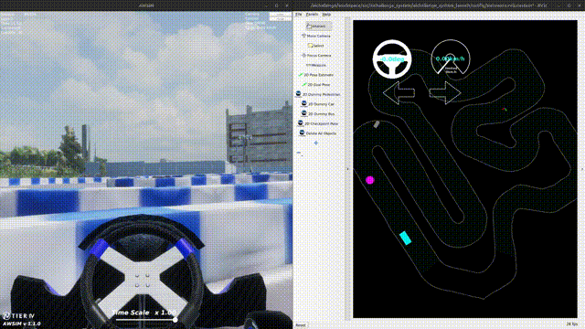
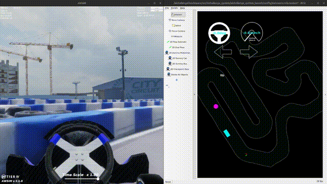
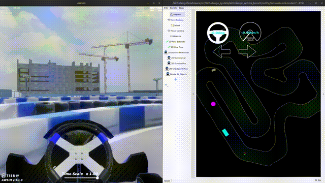

# 予選大会における開発効率化方法の紹介 - Makefile編

## はじめに

本記事では、AIチャレンジ2024予選時にチーム Roborovsky が行っていた、Makefileを用いて開発作業を効率化する方法を紹介します。

## Makefileとは

Makefileと言えば、主にプログラムのビルド時に使用されるものという印象があるかもしれませんが、
実はちょっとしたシェルスクリプト代わりのような使い方もできます。
ここでは、Makefileの仕様について詳しくは書きませんが、簡単な例を示します。

例えば、以下のようなMakefileを作っておきます。
```
create:
	@echo "Creating test file"
	@echo "test" > test

remove:
	@echo "Removing test file"
	@rm test
```

このMakefileがあるディレクトリに `cd` した状態で  `make create` コマンドを実行すると、カレントディレクトリに "test" という文字列が書き込まれた `test` というファイルが生成されます。
また、 `make remove` を実行すると、先程生成されて `test` というファイルが削除されます。

このように、ちょっとした一連のコマンド処理をターゲット名（上記では `create`, `remove`）とともに登録しておくことで、 `make ターゲット名` というコマンドで簡単に実行できるようになります。

当然、シェルスクリプトでも同様のことはできますが、複数のコマンドを実行できるようにするためには複数のスクリプトファイルを作るか、一つのスクリプトファイル内で引数を処理して条件分岐して、といったようなコードを書く必要があり、少し手間がかかります。

Makefileでは、一つのファイルに複数のコマンドを簡単に定義することができ、また一覧することができるので、ちょっとしてコマンド程度であればシェルスクリプトより手軽ではないかと思います。

## 予選において作成したMakefile

AIチャレンジ2024予選においては、AWSIMやAutowareをまとめて実行するための [run_evaluation.bash](https://github.com/AutomotiveAIChallenge/aichallenge-2024/blob/8a870bbe4be388602a84bae17f92d1cdced3c959/aichallenge/run_evaluation.bash)というシェルスクリプトが用意されており、これを用いることで簡単にシミュレーション環境を実行することができます。

一方で、提供されたシェルスクリプトを使っているだけだと何が動いているのかわかりにくいです。
また、独自のノードの開発などをするにあたっては、頻繁にノードの立ち上げ・立ち下げを行いたくなるため、毎回シミュレーション環境を丸ごと立ち上げ直すことは避けたいと考えました。

特に、このスクリプト内では、AWSIMやAutowareの起動や初期化を待つ目的と思われる数秒から数十秒のスリープ処理がいくつか入っているため、環境全体を立ち上げ直すだけでも1,2分の時間がかり、手返しが悪いです。
また、上記スクリプト内では `ros2 bag record` や動作中のシミュレータ画面の録画処理なども実行されるようになっていますが、デバッグ中においてはそこまで必要とならないものかと思います。

そこで、上記スクリプトの内容を機能ごとに分離、必要なものだけを抽出し、機能毎にMakefileのターゲットとして設定しました。
作成したMakefileは[こちら](https://github.com/Roborovsky-Racers/aichallenge-2024/blob/89616b9a868185fd2018cf6cf8efa7dbe8970e7b/aichallenge/Makefile)をご参照ください。

主な使い方としては、 `make setup` により、AWSIMとAutoware、Rvizなどの基本的なノード一式をまず起動します。
その後、 `make mpc` により、開発しているプランナーやその動作に関するノードだけを起動させ、走行を開始させます。
プランナーのコードやパラメータを修正する場合は、 `make mpc` で起動したノードのみを停止した後に、再度 `make mpc` を実行すればよく、AWSIMやAutoware全体を立ち上げ直す必要がありません。
これにより、開発の手返しが良くなり効率が上がります。

## シミュレーション状態のリセット

ただし、コースの途中で壁に衝突したり、プランナーの不具合で走行が止まってしまった場合などは、AWSIMの車両位置やラップのカウント状態などをリセットする必要があります。
シミュレーション環境全体を立ち上げ直すとやはり効率が悪いので、できるだけ手早くシミュレーションの状態をリセットする方法を検討しました。

シミュレーション状態のリセットのためには、大きく以下の２つを行う必要があります。
1. AWSIM の状態のリセット
2. 自己位置推定器の状態のリセット

それぞれ以下に説明します。

### 1. AWSIM の状態のリセット

AWSIMでリセットすべき状態としては、主に以下のものがあります。
- 車両位置をスタート地点に戻す
- ラップ、セクション、コンディションのカウンタをリセットする
- 生成された障害物を全て取り除く

ただ、これらについては全て、7月中頃のAWSIM側のアップデートで実装されたリセット機能で対応されました。
これを実行する方法は、 `/aichallenge/awsim/reset` topic に `std_msgs/msg/Empty` 型のメッセージを publish するだけです。

### 2. 自己位置推定器の状態のリセット

AWSIMのリセット機能によりシミュレータ上の車両位置をスタート地点に戻すことができます。
ただ、これだけだとAutoware側の自己位置推定器(`/localization/ekf_localizer`ノード)については状態がリセットされませんでした。
ですが、GNSSの値などから推定を徐々に修正してくれるようで、以下のgifのようにしばらく待っていると推定値がスタート地点に収束してくれます。



そのため推定が収束するまで待っていれば良いのですが、リセット前の車両位置がスタート地点からそれなりに離れている場合（特に姿勢変位がスタート姿勢より大きめだと）、`ekf_localizer`が出力する自己位置がスタート地点に戻ってくるまで数秒〜十数秒程度かかる場合がありました。
プランナーが自己位置推定結果を使用する場合は、自己位置が収束するまで走行の再開を待たなければならず、これも手返しに関わるためなにか方法がないか調べました。

その結果、一つの方法として `/localization/initial_pose3d` topic に修正先のPoseを publish する方法が見つかりました。
publish するメッセージは、`geometry_msgs/msg/PoseWithCovarianceStamped` 型であるのですが、 `ros2 topic pub` などでCLIから実行するには少し込み入った内容となっていたため、以下のような publisher ノードをpythonで実装しました。

```python
#!/usr/bin/env python3

import sys
import time

# ROS 2
import rclpy
from rclpy.parameter import Parameter
from geometry_msgs.msg import PoseWithCovarianceStamped


def main(argv = sys.argv) -> None:

    rclpy.init(args=argv)

    try:
        node = rclpy.create_node('initialpose_pub_node')
        pub = node.create_publisher(PoseWithCovarianceStamped, '/localization/initial_pose3d', 1)

        # set use_sim_time parameter
        param = Parameter("use_sim_time", Parameter.Type.BOOL, True)
        node.set_parameters([param])

        # wait for clock received
        rclpy.spin_once(node, timeout_sec=1)

        while rclpy.ok() and pub.get_subscription_count() == 0:
            node.get_logger().info("Waiting for subscriber...")
            time.sleep(0.5)

        # create initialpose message
        initialpose = PoseWithCovarianceStamped()
        initialpose.header.stamp = node.get_clock().now().to_msg()
        initialpose.header.frame_id = 'map'
        initialpose.pose.pose.position.x = 89608.61780001601
        initialpose.pose.pose.position.y = 43116.115199306514
        initialpose.pose.pose.position.z = 42.19558715820318
        initialpose.pose.pose.orientation.x= 0.004985082667172698
        initialpose.pose.pose.orientation.y= -0.010414974100889266
        initialpose.pose.pose.orientation.z= 0.873851311038978
        initialpose.pose.pose.orientation.w= 0.4860561320061075
        initialpose.pose.covariance[0] = 0.25
        initialpose.pose.covariance[7] = 0.25
        initialpose.pose.covariance[35] = 0.06853891909122467

        # publish initialpose
        for _ in range(5):
            pub.publish(initialpose)
            time.sleep(0.2)

    except KeyboardInterrupt:
        node.get_logger().info("Shutdown requested")
    finally:
        rclpy.shutdown()


if __name__ == "__main__":
    main(sys.argv)
```

このノード内で設定している初期位置・姿勢の値は、AWSIM, Autoware起動直後の車両位置を `/tf` や `/localization/kinematic_state` topic から取得して設定しました。
また、`covariance` の値は Rviz2 から "2D Pose Estimate" を投げた時に `/initialpose` topic に publish されるメッセージと同じ値を使用しました。
`covariance` の値が初期値の0や小さすぎる値であると、`ekf_localizer`の推定結果の収束が悪かったため、こちらの値を使うのが良さそうでした。

ただ、初期位置設定のメッセージを１回publishするだけだと、以下のgifのように自己位置推定値のスタート地点への収束にまだ少し時間がかかっていました。


そこで模索していたところ、同じメッセージを複数回投げることで、以下のgifのように推定値がより速くスタート地点に収束することを発見したため、最終的には同じメッセージを５回 publish するようにしました。



ここまで説明したリセット処理を `make reset` コマンドで実行できるように[Makefileに記述](https://github.com/Roborovsky-Racers/aichallenge-2024/blob/89616b9a868185fd2018cf6cf8efa7dbe8970e7b/aichallenge/Makefile#L26-L29)しました。
これにより、最後のgifのように素早くシミュレーションの状態をスタートとほぼ同様の状態に戻すことができるようになり、リスタートの手返しが非常に良くなりました。
（動画中では、Rviz上の障害物マーカーが残っているように見えますが、これは単にRviz上に表示が残っているだけで、実際には障害物の状態もリセットされているようです）

## 最後に

本記事では、我々のチームが開発の効率化のために作成した[Makefile](https://github.com/Roborovsky-Racers/aichallenge-2024/blob/89616b9a868185fd2018cf6cf8efa7dbe8970e7b/aichallenge/Makefile)と、そこに実装した内容を紹介しました。
今回説明した内容により、
- AWSIMやAutoware、Rvizなどのシミュレータ環境の立ち上げが簡単になった
- メインでデバッグしたいプランナーのノードだけを簡単に起動や再起動できるようになった
- シミュレーションの状態を素早くリセットできるようになった

といった改善が実現され、開発の効率が当初より非常に良くなりました。
既に予選は終わってしまいましたが、本戦に向けたシミュレーション検討や、来年以降の大会などの参考になれば幸いです。


---


[Roborovsky Note トップページ](https://roborovsky-racers.github.io/RoborovskyNote/)
